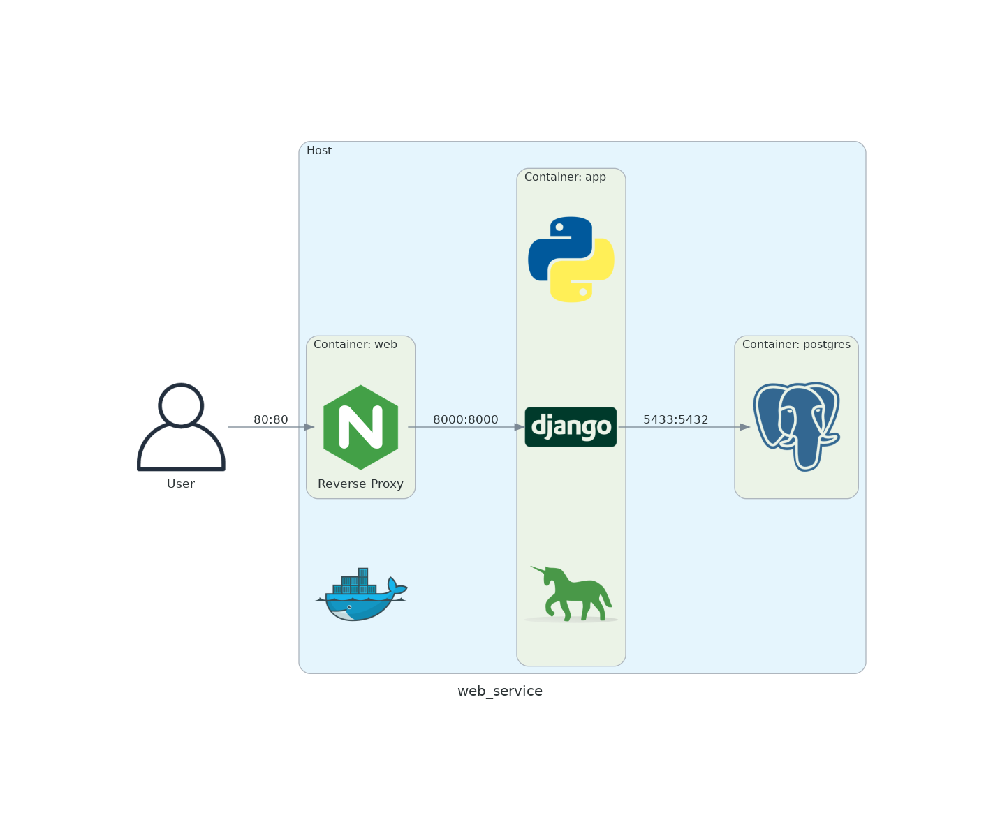

# 勤怠管理システム

## 概要
勤怠を管理するためのアプリケーションです。

## URL
https://pawgrammer.click/accounts/login/

## テスト用アカウント
ログイン画面に情報を記載しています。

## 利用方法
一般ユーザー：ダッシュボードで出勤、退勤、休憩開始、休憩終了の打刻します。  
その後、打刻一覧から「勤怠を締める」をクリックすることで承認申請ができます。  
また、勤怠情報は打刻一覧から編集が可能です。  
一括で変更する場合は、打刻一覧 右上の3点リーダーから出力したExcelを取り込みます。

管理ユーザー：一般ユーザーで行える操作に加えて以下が可能です。  
承認待ち一覧から承認申請を「承認」または「差戻」ができます。  
※自分自身の承認申請を承認、差戻はできない。  
また、ダッシュボード下部には他ユーザーの出勤情報が表示されます。


## システム構成図


## 全体の構成


構成図作成に用いたツール  
https://diagrams.mingrammer.com/

## 開発環境構築手順

DBを作成する。

```bash
> createdb -U postgres -E UTF-8 attendance_management_system
> psql -U postgres -l
```

## .env

`SECRET_KEY`は以下の手順で環境ごとに異なる値を設定する。

```bash
$ python manage.py shell
>>> from django.core.management.utils import get_random_secret_key
>>> get_random_secret_key()
'SECRET_KEYが出力される'